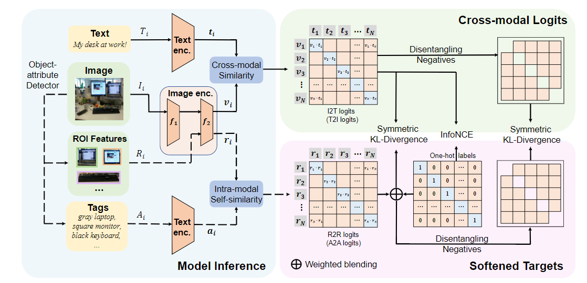

# Cross Modal

| No. |Figure   |                                                     Title                                                     |      Pub.      |                                                                                                Link                                                                                                 |         
|:----|:-----:|:-------------------------------------------------------------------------------------------------------------:|:--------------:|:---------------------------------------------------------------------------------------------------------------------------------------------------------------------------------------------------:|
| 1   ||                        __Weakly Supervised Semantic Segmentation for Driving Scenes__                         | __AAAI 2024__  |                                                      [`Paper`](https://arxiv.org/pdf/2312.13646v3) [`Github`](https://github.com/k0u-id/carb/)                                                      |
| 2   ||                 __DetCLIPv3: Towards Versatile Generative Open-vocabulary Object Detection__                  | __CVPR 2024__  |                                                                     [`Paper`](https://arxiv.org/pdf/2404.09216v1) [`Github`]()                                                                      |
| 3   ||                   __Progressive Semantic-Guided Vision Transformer for Zero-Shot Learning__                   | __CVPR 2024__  |                                                  [`Paper`](https://arxiv.org/pdf/2404.07713v2) [`Github`](https://github.com/shiming-chen/zslvit)                                                   |
| 4   ||                 __Learn to Rectify the Bias of CLIP for Unsupervised Semantic Segmentation__                  | __CVPR 2024__  | [`Paper`](https://openaccess.thecvf.com/content/CVPR2024/papers/Wang_Learn_to_Rectify_the_Bias_of_CLIP_for_Unsupervised_Semantic_CVPR_2024_paper.pdf) [`Github`](https://github.com/dogehhh/reclip) |
| 5   || __AllSpark: Reborn Labeled Features from Unlabeled in Transformer for Semi-Supervised Semantic SegmentatioN__ | __CVPR 2024__  |                                                   [`Paper`](https://arxiv.org/pdf/2403.01818v3) [`Github`](https://github.com/xmed-lab/AllSpark)                                                    |
| 6   ||                  __OMG-Seg: Is One Model Good Enough For All Segmentation?__                   | __CVPR 2024__  |                                                                     [`Paper`](https://arxiv.org/pdf/2401.10229v1) [`Github`](https://github.com/lxtgh/omg-seg)                                                                      |
| 7   ||                   __Unified Unsupervised Salient Object Detection via Knowledge Transfer__                    | __IJCAI 2024__ |                                                   [`Paper`](https://arxiv.org/pdf/1905.04405.pdf) [`Github`](https://github.com/ronghanghu/lcgn)                                                    |
| 8   ||                         __Towards Omni-supervised Referring Expression Segmentation__                         |    __2023__    |                                                    [`Paper`](https://arxiv.org/pdf/2311.00397v2) [`Github`](https://github.com/nineblu/omni-res)                                                    |
| 9   |            |                         __Open-Vocabulary Segmentation with Semantic-Assisted Calibration__                         | __CVPR 2024__  |             [`Paper`](https://arxiv.org/pdf/2312.04089) [`Github`](https://github.com/yongliu20/SCAN)                                                    |
| 10  |    |                         __SoftCLIP: Softer Cross-modal Alignment Makes CLIP Stronger__                         | __CVPR 2024__  |             [`Paper`](https://arxiv.org/pdf/2303.17561v2)                                                   |
| 11  |            |                         __Cross-Modal and Uni-Modal Soft-Label Alignment for Image-Text Retrieval__                         | __AAAI 2024__  |             [`Paper`](https://arxiv.org/pdf/2403.05261v1) [`Github`](https://github.com/lerogo/aaai24_itr_cusa)                                                    |
| 12  |      |                         __Universal Segmentation at Arbitrary Granularity with Language Instruction__                         | __CVPR 2024__  |             [`Paper`](https://arxiv.org/pdf/2312.01623v3) [`Github`](https://github.com/yongliu20/UniLSeg)                                                    |
| 13  |         |                         __Linguistic-Aware Patch Slimming Framework for Fine-grained Cross-Modal Alignment__                         | __CVPR 2024__  |             [`Paper`](https://openaccess.thecvf.com/content/CVPR2024/papers/Fu_Linguistic-Aware_Patch_Slimming_Framework_for_Fine-grained_Cross-Modal_Alignment_CVPR_2024_paper.pdf) [`Github`](https://github.com/crossmodalgroup/laps)                                                    |
| 14  |         |                         __Improved Zero-Shot Classification by Adapting VLMs with Text Descriptions__                         | __CVPR 2024__  |             [`Paper`](https://arxiv.org/pdf/2401.02460v2) [`Github`](https://github.com/cvl-umass/adaptclipzs)                                                    |
| 15  |         |                         __Language-only Efficient Training of Zero-shot Composed Image Retrieval__                         | __CVPR 2024__  |             [`Paper`](https://arxiv.org/pdf/2312.01998v2) [`Github`](https://github.com/navervision/lincir)                                                    |
| 16  |         |                         __Frozen Feature Augmentation for Few-Shot Image Classification__                         | __CVPR 2024__  |             [`Paper`](https://arxiv.org/pdf/2403.10519v2)          
