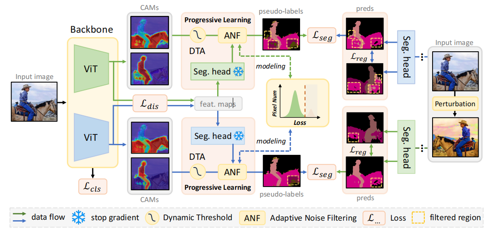
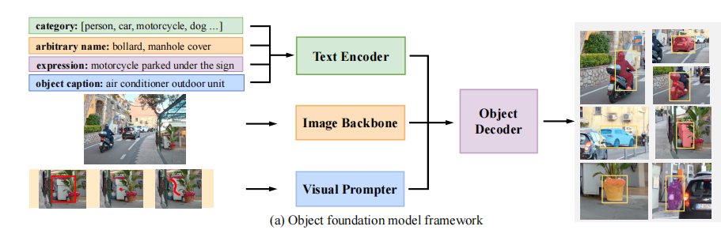
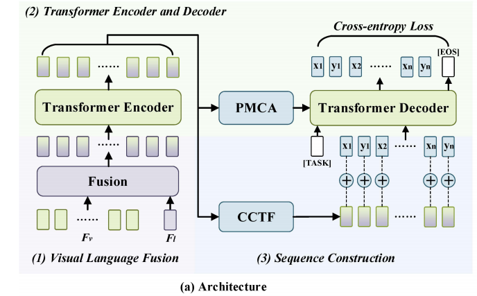
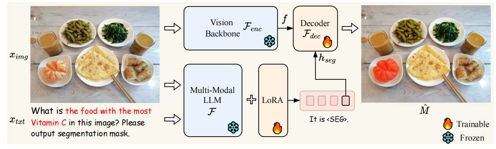
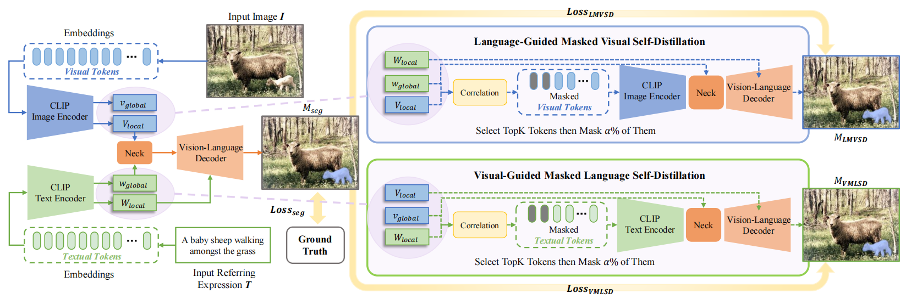
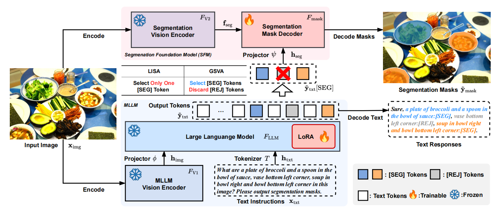
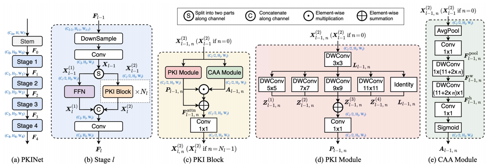
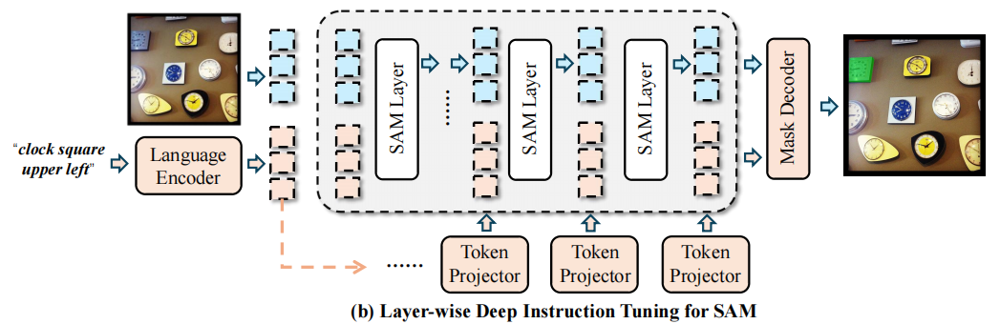

# Cross Modal

|No.   |Figure   |Title   |Pub.  |Link|         
|:----|:-----:|:-----:|:-----:|:---:|
|1||__COSALPURE:Learning Concept from Group Images for Robust Co-Saliency Detection__|__CVPR 2024__|[`Paper`](https://arxiv.org/abs/2403.18554) [`Github`](https://v1len.github.io/CosalPure)|
|2||__Curriculum Point Prompting for Weakly-Supervised Referring Image Segmentation__|__CVPR 2024__|[`Paper`](https://arxiv.org/abs/2404.11998) [`Github`](https://github.com/MarkMoHR/Awesome-Referring-Image-Segmentation)|
|3||__Class Tokens Infusion for Weakly Supervised Semantic Segmentation__|__CVPR 2024__|[`Paper`](https://openaccess.thecvf.com/content/CVPR2024/papers/Yoon_Class_Tokens_Infusion_for_Weakly_Supervised_Semantic_Segmentation_CVPR_2024_paper.pdf) [`Github`](https://github.com/yoon307/CTI)|
|4||__Frozen CLIP: A Strong Backbone for Weakly Supervised Semantic Segmentation__|__CVPR 2024__|[`Paper`](https://arxiv.org/abs/2406.11189) [`Github`](https://github.com/zbf1991/WeCLIP)|
|5||__GRES: Generalized Referring Expression Segmentation__|__CVPR 2023__|[`Paper`](https://arxiv.org/abs/2306.00968) [`Github`](https://henghuiding.github.io/GRES)|
|6||__Mask Grounding for Referring Image Segmentation__|__CVPR 2024__|[`Paper`](https://arxiv.org/abs/2312.12198) [`Github`](https://github.com/yxchng/mask-grounding)|
|7||__Prompt-Driven Referring Image Segmentation with Instance Contrasting__|__CVPR 2024__|[`Paper`](https://openaccess.thecvf.com/content/CVPR2024/papers/Shang_Prompt-Driven_Referring_Image_Segmentation_with_Instance_Contrasting_CVPR_2024_paper.pdf) |
|8||__Unveiling Parts Beyond Objects:Towards Finer-Granularity Referring Expression Segmentation__|__CVPR 2024__|[`Paper`](https://arxiv.org/abs/2312.08007) [`Github`](https://github.com/Rubics-Xuan/MRES)|
|9||__USE: Universal Segment Embeddings for Open-Vocabulary Image Segmentation__|__CVPR 2024__|[`Paper`](https://openaccess.thecvf.com/content/CVPR2024/papers/Wang_USE_Universal_Segment_Embeddings_for_Open-Vocabulary_Image_Segmentation_CVPR_2024_paper.pdf) |
|10||__Revisiting Counterfactual Problems in Referring Expression Comprehension__|__CVPR 2024__|[`Paper`](https://openaccess.thecvf.com/content/CVPR2024/papers/Yu_Revisiting_Counterfactual_Problems_in_Referring_Expression_Comprehension_CVPR_2024_paper.pdf) [`Github`](https://github.com/Glacier0012/CREC)|
|11||__Zero-shot Referring Expression Comprehension via Structural Similarity Between Images and Captions__|__CVPR 2024__|[`Paper`](https://arxiv.org/abs/2311.17048) [`Github`](https://github.com/Show-han/Zeroshot_REC) |
|12||__DuPL: Dual Student with Trustworthy Progressive Learning for Robust Weakly Supervised Semantic Segmentation__|__CVPR 2024__|[`Paper`](https://openaccess.thecvf.com/content/CVPR2024/supplemental/Wu_DuPL_Dual_Student_CVPR_2024_supplemental.pdf) [`Github`](https://github.com/Wu0409/DuPL)|
|13||__General Object Foundation Model for Images and Videos at Scale__|__CVPR 2024__|[`Paper`](https://openaccess.thecvf.com/content/CVPR2024/papers/Wu_General_Object_Foundation_Model_for_Images_and_Videos_at_Scale_CVPR_2024_paper.pdf) [`Github`](https://glee-vision.github.io/)|
|14||__Learning to Segment Every Referring Object Point by Point__|__CVPR 2024__|[`Paper`](https://openaccess.thecvf.com/content/CVPR2024/papers/Yoon_Class_Tokens_Infusion_for_Weakly_Supervised_Semantic_Segmentation_CVPR_2024_paper.pdf)|
|15||__LISA: Reasoning Segmentation via Large Language Model__|__CVPR 2024__|[`Paper`](https://openaccess.thecvf.com/content/CVPR2024/papers/Lai_LISA_Reasoning_Segmentation_via_Large_Language_Model_CVPR_2024_paper.pdf) [`Github`](https://github.com/dvlabresearch/LISA)|
|16||__CM-MaskSD: Cross-Modality Masked Self-Distillation for Referring Image Segmentation__|__IEEE 2024__|[`Paper`](https://ieeexplore.ieee.org/document/10413654)|
|17||__GSVA: Generalized Segmentation via Multimodal Large Language Models__|__CVPR 2024__|[`Paper`](https://openaccess.thecvf.com/content/CVPR2024/papers/Xia_GSVA_Generalized_Segmentation_via_Multimodal_Large_Language_Models_CVPR_2024_paper.pdf) [`Github`](https://github.com/LeapLabTHU/GSVA)|
|18||__Poly Kernel Inception Network for Remote Sensing Detection__|__CVPR 2024__|[`Paper`](https://openaccess.thecvf.com/content/CVPR2024/papers/Cai_Poly_Kernel_Inception_Network_for_Remote_Sensing_Detection_CVPR_2024_paper.pdf) [`Github`](https://github.com/NUST-Machine-Intelligence-Laboratory/PKINet)|
|19||__Deep Instruction Tuning for Segment Anything Model__|__ACM Multimedia 2024__|[`Paper`](https://arxiv.org/pdf/2404.00650) [`Github`](https://github.com/wysnzzzz/DIT)|
