# Cross Modal

|No.   |Figure   |Title   |Pub.  |Link|         
|:----|:-----:|:-----:|:-----:|:---:|
|1|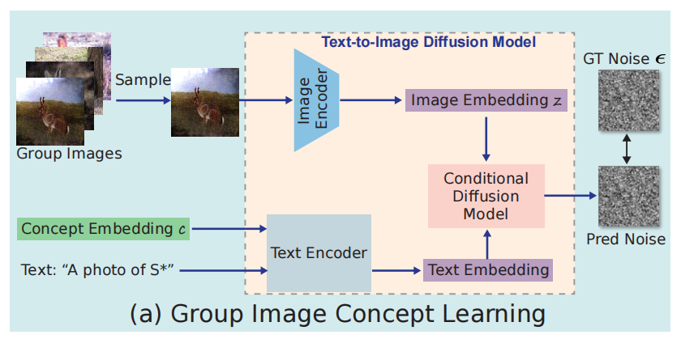|__COSALPURE:Learning Concept from Group Images for Robust Co-Saliency Detection__|__CVPR 2024__|[`Paper`](https://arxiv.org/abs/2403.18554) [`Github`](https://v1len.github.io/CosalPure)|
|2|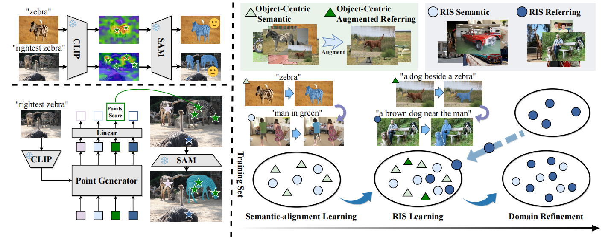|__Curriculum Point Prompting for Weakly-Supervised Referring Image Segmentation__|__CVPR 2024__|[`Paper`](https://arxiv.org/abs/2404.11998) [`Github`](https://github.com/MarkMoHR/Awesome-Referring-Image-Segmentation)|
|3|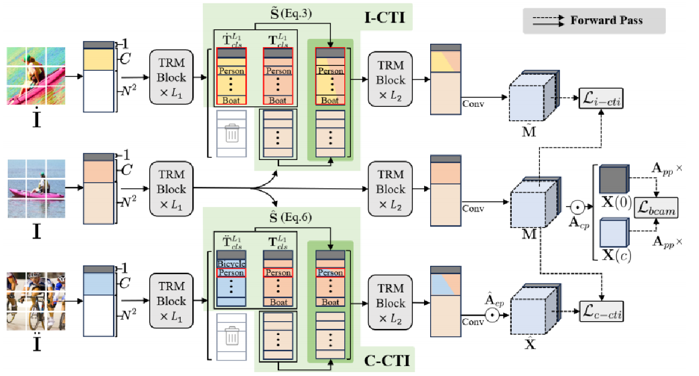|__Class Tokens Infusion for Weakly Supervised Semantic Segmentation__|__CVPR 2024__|[`Paper`](https://openaccess.thecvf.com/content/CVPR2024/papers/Yoon_Class_Tokens_Infusion_for_Weakly_Supervised_Semantic_Segmentation_CVPR_2024_paper.pdf) [`Github`](https://github.com/yoon307/CTI)|
|4|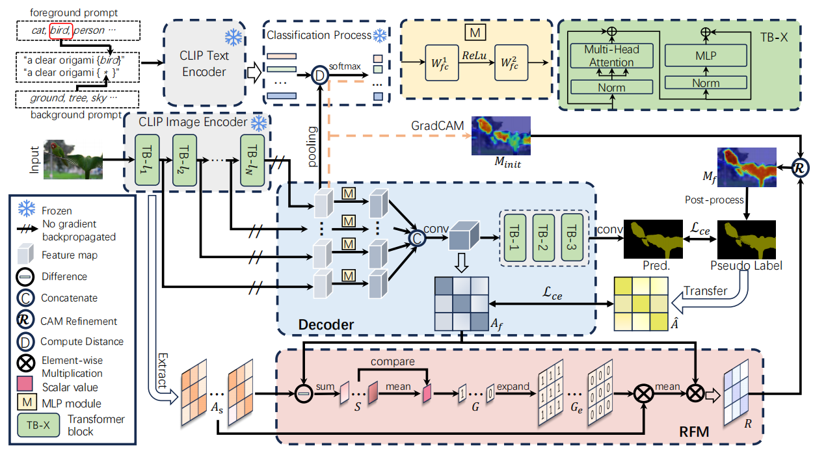|__Frozen CLIP: A Strong Backbone for Weakly Supervised Semantic Segmentation__|__CVPR 2024__|[`Paper`](https://arxiv.org/abs/2406.11189) [`Github`](https://github.com/zbf1991/WeCLIP)|
|5|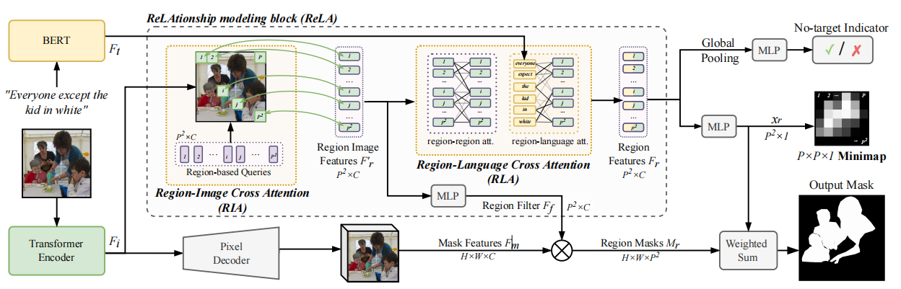|__GRES: Generalized Referring Expression Segmentation__|__CVPR 2023__|[`Paper`](https://arxiv.org/abs/2306.00968) [`Github`](https://henghuiding.github.io/GRES)|
|6|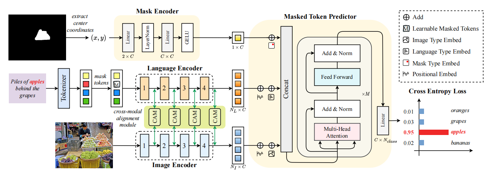|__Mask Grounding for Referring Image Segmentation__|__CVPR 2024__|[`Paper`](https://arxiv.org/abs/2312.12198) [`Github`](https://github.com/yxchng/mask-grounding)|
|7|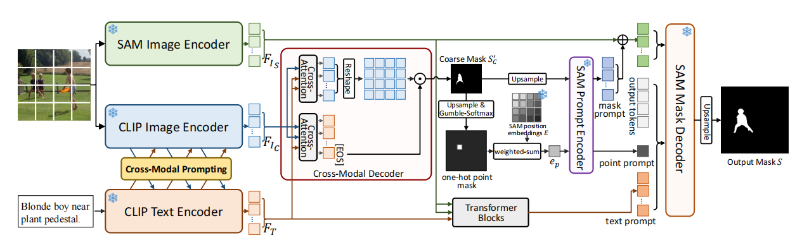|__Prompt-Driven Referring Image Segmentation with Instance Contrasting__|__CVPR 2024__|[`Paper`](https://openaccess.thecvf.com/content/CVPR2024/papers/Shang_Prompt-Driven_Referring_Image_Segmentation_with_Instance_Contrasting_CVPR_2024_paper.pdf) |
|8|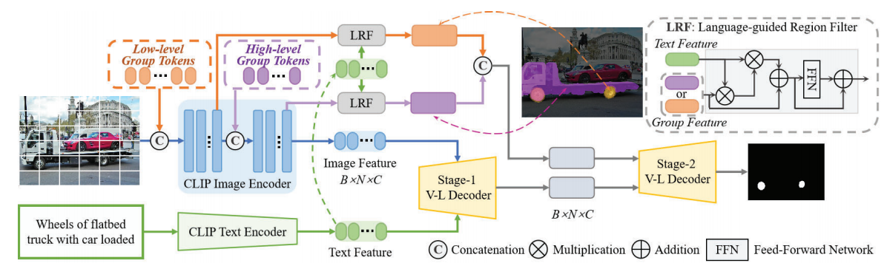|__Unveiling Parts Beyond Objects:Towards Finer-Granularity Referring Expression Segmentation__|__CVPR 2024__|[`Paper`](https://arxiv.org/abs/2312.08007) [`Github`](https://github.com/Rubics-Xuan/MRES)|
|9|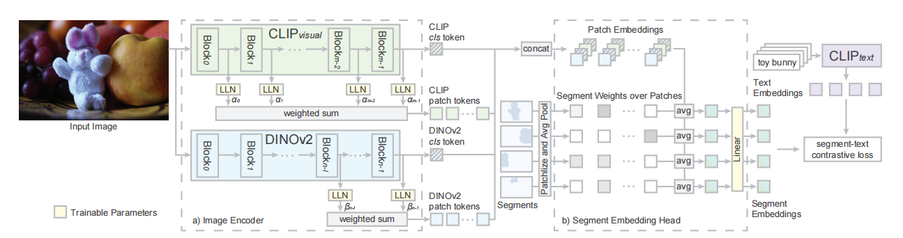|__USE: Universal Segment Embeddings for Open-Vocabulary Image Segmentation__|__CVPR 2024__|[`Paper`](https://openaccess.thecvf.com/content/CVPR2024/papers/Wang_USE_Universal_Segment_Embeddings_for_Open-Vocabulary_Image_Segmentation_CVPR_2024_paper.pdf) |
|10|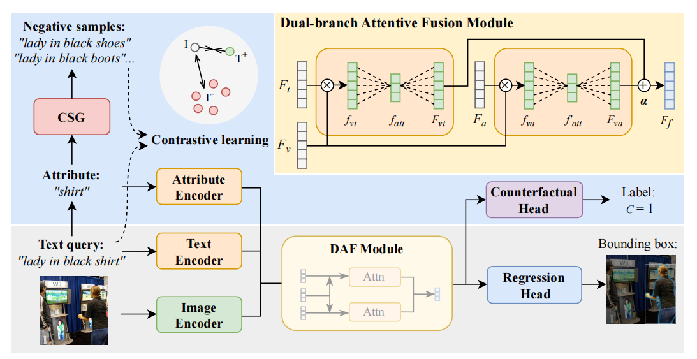|__Revisiting Counterfactual Problems in Referring Expression Comprehension__|__CVPR 2024__|[`Paper`](https://openaccess.thecvf.com/content/CVPR2024/papers/Yu_Revisiting_Counterfactual_Problems_in_Referring_Expression_Comprehension_CVPR_2024_paper.pdf) [`Github`](https://github.com/Glacier0012/CREC)|
|11|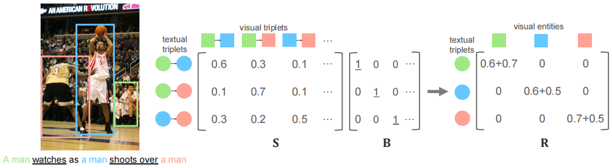|__Zero-shot Referring Expression Comprehension via Structural Similarity Between Images and Captions__|__CVPR 2024__|[`Paper`](https://arxiv.org/abs/2311.17048) [`Github`](https://github.com/Show-han/Zeroshot_REC) |
