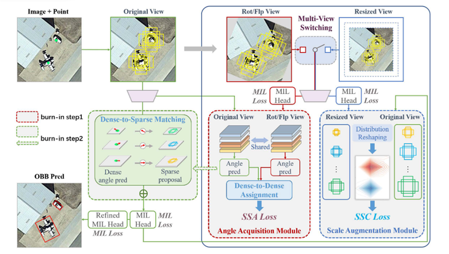

# Referring Expression Comprehension
|No.   |Figure   |Title   |Pub.  |Link|         
|:----|:-----:|:-----:|:-----:|:---:|
|1||__Rethinking Two-Stage Referring Expression Comprehension: A Novel Grounding and Segmentation Method Modulated by Point__|__CVPR 2024__|[`Paper`](https://arxiv.org/pdf/2112.05375v1) [`Github`](https://github.com/kellyiss/situformer) |
|2||__LoSh: Long-Short Text Joint Prediction Network for Referring Video Object Segmentation__|__CVPR 2024__|[`Paper`](https://arxiv.org/pdf/2306.08736v3) [`Github`](https://github.com/linfengyuan1997/losh) |
|3||__Zero-shot Referring Expression Comprehension via Structural Similarity Between Images and Captions__|__CVPR 2024__|[`Paper`](https://arxiv.org/pdf/2311.17048v3) [`Github`](https://github.com/show-han/zeroshot_rec) |
# Object Detection
|No.   |Figure   |Title   |Pub.  |Link|         
|:----|:-----:|:-----:|:-----:|:---:|
|1||__YOLO-World: Real-Time Open-Vocabulary Object Detection__|__CVPR 2024__|[`Paper`](https://arxiv.org/pdf/2401.17270v3) [`Github`](https://github.com/ailab-cvc/yolo-world) |
|2||__DETRs Beat YOLOs on Real-time Object Detection__|__CVPR 2024__|[`Paper`](https://arxiv.org/pdf/2304.08069v3) [`Github`](https://github.com/lyuwenyu/RT-DETR) |
|3||__IS-FUSION: Instance-Scene Collaborative Fusion for Multimodal 3D Object Detection__|__CVPR 2024__|[`Paper`](https://arxiv.org/pdf/2403.15241v1) [`Github`](https://github.com/yinjunbo/is-fusion) |
|4||__Prompt3D: Random Prompt Assisted Weakly-Supervised 3D Object Detection__|__CVPR 2024__|[`Paper`](https://openaccess.thecvf.com//content/CVPR2024/papers/Zhang_Prompt3D_Random_Prompt_Assisted_Weakly-Supervised_3D_Object_Detection_CVPR_2024_paper.pdf) [`Github`](https://github.com/huishengye/prompt3d) |
|5||__PointOBB: Learning Oriented Object Detection via Single Point Supervision__|__CVPR 2024__|[`Paper`](https://arxiv.org/pdf/2311.14757v1) [`Github`](https://github.com/luo-z13/pointobb) |
|6||__Plug and Play Active Learning for Object Detection__|__CVPR 2024__|[`Paper`](https://arxiv.org/pdf/2211.11612v2) [`Github`](https://github.com/chenhongyiyang/ppal) |
|7||__SAFDNet: A Simple and Effective Network for Fully Sparse 3D Object Detection__|__CVPR 2024__|[`Paper`](https://arxiv.org/pdf/2403.05817v2) [`Github`](https://github.com/zhanggang001/hednet) |
|8||__Learning Occupancy for Monocular 3D Object Detection__|__CVPR 2024__|[`Paper`](https://arxiv.org/pdf/2305.15694v1) [`Github`](https://github.com/spengliang/occupancym3d) |
|9||__Taming Self-Training for Open-Vocabulary Object Detection__|__CVPR 2024__|[`Paper`](https://arxiv.org/pdf/2308.06412v3) [`Github`](https://github.com/xiaofeng94/sas-det) |
|10||__Weak-to-Strong 3D Object Detection with X-Ray Distillation__|__CVPR 2024__|[`Paper`](https://arxiv.org/pdf/2404.00679v1) [`Github`](https://github.com/sakharok13/x-ray-teacher-patching-tools) |
|11||__RCBEVDet: Radar-camera Fusion in Bird's Eye View for 3D Object Detection__|__CVPR 2024__|[`Paper`](https://arxiv.org/pdf/2403.16440v1) [`Github`](https://github.com/vdigpku/rcbevdet) |
|12||__HINTED: Hard Instance Enhanced Detector with Mixed-Density Feature Fusion for Sparsely-Supervised 3D Object Detection__|__CVPR 2024__|[`Paper`](https://openaccess.thecvf.com//content/CVPR2024/papers/Xia_HINTED_Hard_Instance_Enhanced_Detector_with_Mixed-Density_Feature_Fusion_for_CVPR_2024_paper.pdf) [`Github`](https://github.com/xmuqimingxia/hinted) |
|13||__Exploring Orthogonality in Open World Object Detection__|__CVPR 2024__|[`Paper`](https://openaccess.thecvf.com//content/CVPR2024/papers/Sun_Exploring_Orthogonality_in_Open_World_Object_Detection_CVPR_2024_paper.pdf) [`Github`](https://github.com/feifeiobama/orthogonaldet) |
|14||__Point2RBox: Combine Knowledge from Synthetic Visual Patterns for End-to-end Oriented Object Detection with Single PointSupervision__|__CVPR 2024__|[`Paper`](https://arxiv.org/pdf/2311.14758v2) [`Github`](https://github.com/yuyi1005/point2rbox-mmrotate) |
|15||__D3T: Distinctive Dual-Domain Teacher Zigzagging Across RGB-Thermal Gap for Domain-Adaptive Object Detection__|__CVPR 2024__|[`Paper`](https://arxiv.org/pdf/2403.09359v1) [`Github`](https://github.com/edwarddo69/d3t) |
|16||__MonoCD: Monocular 3D Object Detection with Complementary Depths__|__CVPR 2024__|[`Paper`](https://arxiv.org/pdf/2404.03181v1) [`Github`](https://github.com/elvintanhust/monocd) |
|17||__Retrieval-Augmented Open-Vocabulary Object Detection__|__CVPR 2024__|[`Paper`](https://arxiv.org/pdf/2404.05687v1) [`Github`](https://github.com/mlvlab/RALF) |
|18||__Generative Region-Language Pretraining for Open-Ended Object Detection__|__CVPR 2024__|[`Paper`](https://arxiv.org/pdf/2403.10191v1) [`Github`](https://github.com/foundationvision/generateu) |
|19||__Improving Single Domain-Generalized Object Detection: A Focus on Diversification and Alignment__|__CVPR 2024__|[`Paper`](https://arxiv.org/pdf/2405.14497v1) [`Github`](https://github.com/msohaildanish/divalign) |
|20||__SHiNe: Semantic Hierarchy Nexus for Open-vocabulary Object Detection__|__CVPR 2024__|[`Paper`](https://arxiv.org/pdf/2405.10053v1) [`Github`](https://github.com/naver/shine) |
|21||__Commonsense Prototype for Outdoor Unsupervised 3D Object Detection__|__CVPR 2024__|[`Paper`](https://arxiv.org/pdf/2404.16493v3) [`Github`](https://github.com/hailanyi/cpd) |
|22||__VSRD: Instance-Aware Volumetric Silhouette Rendering for Weakly Supervised 3D Object Detection__|__CVPR 2024__|[`Paper`](https://arxiv.org/pdf/2404.00149v1) [`Github`](https://github.com/skmhrk1209/VSRD) |
|23||__Active Object Detection with Knowledge Aggregation and Distillation from Large Models__|__CVPR 2024__|[`Paper`](https://arxiv.org/pdf/2405.12509v1) [`Github`](https://github.com/idejie/KAD) |
|24||__Scene Adaptive Sparse Transformer for Event-based Object Detection__|__CVPR 2024__|[`Paper`](https://arxiv.org/pdf/2404.01882v1) [`Github`](https://github.com/peterande/sast) |
|25||__Rethinking Boundary Discontinuity Problem for Oriented Object Detection__|__CVPR 2024__|[`Paper`](https://arxiv.org/pdf/2305.10061v2) [`Github`](https://github.com/hangxu-cv/cvpr24acm) |
# Multi-Model
|No.   |Figure   |Title   |Pub.  |Link|         
|:----|:-----:|:-----:|:-----:|:---:|
|1||__Adapting Visual-Language Models for Generalizable Anomaly Detection in Medical Images__|__CVPR 2024__|[`Paper`](https://arxiv.org/pdf/2403.12570v1) [`Github`](https://github.com/mediabrain-sjtu/mvfa-ad) |
|2||__TCP:Textual-based Class-aware Prompt tuning for Visual-Language Model__|__CVPR 2024__|[`Paper`](https://arxiv.org/pdf/2311.18231v2) [`Github`](https://github.com/htyao89/textual-based_class-aware_prompt_tuning) |
|3||__MMA: Multi-Modal Adapter for Vision-Language Models__|__CVPR 2024__|[`Paper`](https://openaccess.thecvf.com//content/CVPR2024/papers/Yang_MMA_Multi-Modal_Adapter_for_Vision-Language_Models_CVPR_2024_paper.pdf) [`Github`](https://github.com/zjjconan/multi-modal-adapter) |
|4||__Visual-Augmented Dynamic Semantic Prototype for Generative Zero-Shot Learning__|__CVPR 2024__|[`Paper`](https://arxiv.org/pdf/2404.14808v1) |
|5||__Learning to Localize Objects Improves Spatial Reasoning in Visual-LLMs__|__CVPR 2024__|[`Paper`](https://arxiv.org/pdf/2404.07449v1)  |
|6||__Prompting Multi-Modal Image Segmentation with Semantic Grouping__|__AAAI 2024__|[`Paper`](https://ojs.aaai.org/index.php/AAAI/article/view/27981) |
|7||__Referred by Multi-Modality: A Unified Temporal Transformer for Video Object Segmentation__|__AAAI 2024__|[`Paper`](https://ojs.aaai.org/index.php/AAAI/article/view/28465) [`Github`](https://github.com/opengvlab/mutr)|
|8||__Multi-Modal Prompting for Open-Vocabulary Video Visual Relationship Detection__|__AAAI 2024__|[`Paper`](https://ojs.aaai.org/index.php/AAAI/article/view/28472) [`Github`](https://github.com/wangyongqi558/MMP_OV_VidVRD)|
|9||__WinCLIP: Zero-/Few-Shot Anomaly Classification and Segmentation__|__CVPR 2023__|[`Paper`](https://arxiv.org/pdf/2303.14814v1) [`Github`](https://github.com/zqhang/Accurate-WinCLIP-pytorch)|
|10||__CLIP-Driven Universal Model for Organ Segmentation and Tumor Detection__|__ICCV 2023__|[`Paper`](https://arxiv.org/pdf/2301.00785v5) [`Github`](https://github.com/ljwztc/clip-driven-universal-model)|
|11||__Anomaly Detection via Reverse Distillation from One-Class Embedding__|__CVPR 2022__|[`Paper`](https://arxiv.org/pdf/2201.10703v2) [`Github`](https://github.com/hq-deng/RD4AD)|
|12||__CLIP-Adapter: Better Vision-Language Models with Feature Adapters__|__IJCV 2024__|[`Paper`](https://arxiv.org/pdf/2110.04544v1) [`Github`](https://github.com/gaopengcuhk/clip-adapter)|
|13||__Bridging Vision and Language Encoders: Parameter-Efficient Tuning for Referring Image Segmentation__|__ICCV 2023__|[`Paper`](https://arxiv.org/pdf/2307.11545v1) [`Github`](https://github.com/kkakkkka/etris)|
|14||__UNETR++: Delving into Efficient and Accurate 3D Medical Image Segmentation__|__IEEE 2024__|[`Paper`](https://arxiv.org/pdf/2212.04497v3) [`Github`](https://github.com/amshaker/unetr_plus_plus)|
|15||__PromptKD: Unsupervised Prompt Distillation for Vision-Language Models__|__CVPR 2024__|[`Paper`](https://arxiv.org/pdf/2403.02781v4) [`Github`](https://github.com/zhengli97/promptkd)|
|16||__VoCo: A Simple-yet-Effective Volume Contrastive Learning Framework for 3D Medical Image Analysiss__|__CVPR 2024__|[`Paper`](https://arxiv.org/pdf/2402.17300v2) [`Github`](https://github.com/luffy03/voco)|
