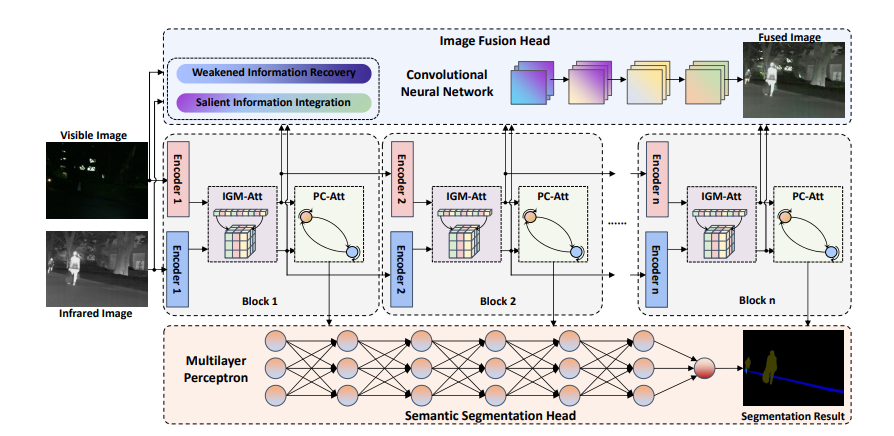
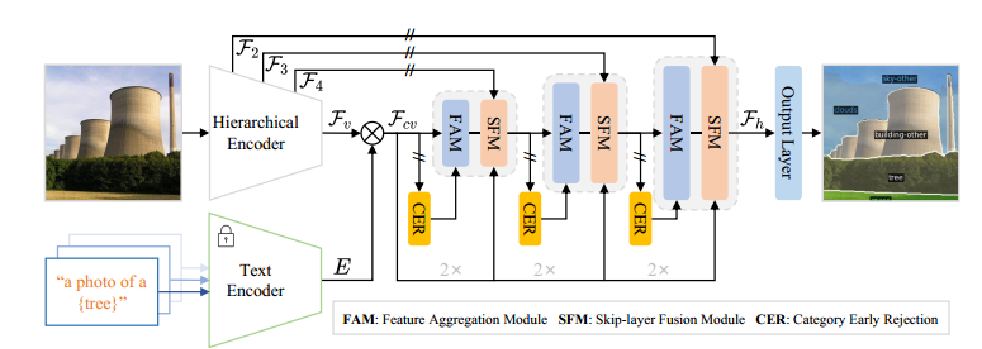
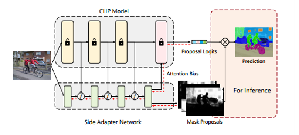
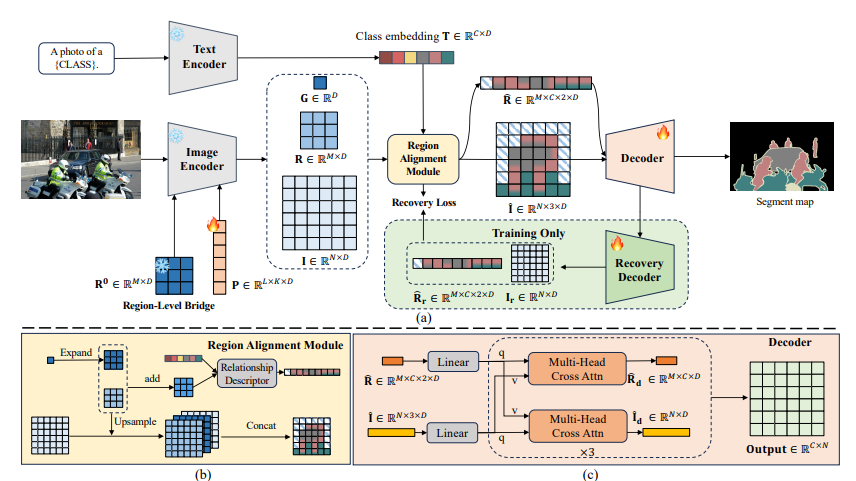

# Object Detection
|No.   |            Figure            |Title   |     Pub.      |Link|         
|:----|:----------------------------:|:-----:|:-------------:|:---:|
|1|  |__GroundVLP: Harnessing Zero-Shot Visual Grounding from Vision-Language Pre-training and Open-Vocabulary Object Detection__| __AAAI 2024__ |[`Paper`](https://ojs.aaai.org/index.php/AAAI/article/view/28278) [`Github`](https://github.com/om-ai-lab/groundvlp) |
|2|  |__Zero-Shot Aerial Object Detection with Visual Description Regularization__| __AAAI 2024__ |[`Paper`](https://ojs.aaai.org/index.php/AAAI/article/view/28518) [`Github`](https://github.com/zq-zang/DescReg) |
| 3   |  |__LOG-CAN: LOCAL-GLOBAL CLASS-AWARE NETWORK FOR SEMANTIC SEGMENTATION OF REMOTE SENSING IMAGES__| __IEEE 2024__ |[`Paper`](https://ieeexplore.ieee.org/document/10095835)  [`Github`](https://github.com/xwmaxwma/rssegmentation)|
# Segmentation
| No. |            Figure             |Title   |     Pub.      |Link|         
|:----|:-----------------------------:|:-----:|:-------------:|:---:|
| 1   |   |__RMem: Restricted Memory Banks Improve Video Object Segmentation__| __CVPR 2024__ |[`Paper`](https://openaccess.thecvf.com/content/CVPR2024/papers/Zhou_RMem_Restricted_Memory_Banks_Improve_Video_Object_Segmentation_CVPR_2024_paper.pdf) ) |
| 2   |   |__Exploring Regional Clues in CLIP for Zero-Shot Semantic Segmentation__| __CVPR 2024__ |[`Paper`](https://openaccess.thecvf.com/content/CVPR2024/papers/Zhang_Exploring_Regional_Clues_in_CLIP_for_Zero-Shot_Semantic_Segmentation_CVPR_2024_paper.pdf) [`Github`](https://github.com/Jittor/Jseg) |
| 3   |  |__PEM: Prototype-based Efficient MaskFormer for Image Segmentation__| __CVPR 2024__ |[`Paper`](https://openaccess.thecvf.com/content/CVPR2024/papers/Cavagnero_PEM_Prototype-based_Efficient_MaskFormer_for_Image_Segmentation_CVPR_2024_paper.pdf) [`Github`](https://github.com/niccolocavagnero/pem) |
| 4   |  |__GROUNDHOG: Grounding Large Language Models to Holistic Segmentation__| __CVPR 2024__ |[`Paper`](https://openaccess.thecvf.com/content/CVPR2024/papers/Zhang_GROUNDHOG_Grounding_Large_Language_Models_to_Holistic_Segmentation_CVPR_2024_paper.pdf) [`Github`](https://groundhog-mllm.github.io/)|
| 5   |  |__MRFS: Mutually Reinforcing Image Fusion and Segmentation__| __CVPR 2024__ |[`Paper`](https://openaccess.thecvf.com/content/CVPR2024/papers/Zhang_MRFS_Mutually_Reinforcing_Image_Fusion_and_Segmentation_CVPR_2024_paper.pdf)  [`Github`](https://github.com/haozhang1018/mrfs)|
| 6   |  |__Unraveling Instance Associations: A Closer Look for Audio-Visual Segmentation __| __CVPR 2024__ |[`Paper`](https://openaccess.thecvf.com/content/CVPR2024/papers/Chen_Unraveling_Instance_Associations_A_Closer_Look_for_Audio-Visual_Segmentation_CVPR_2024_paper.pdf) [`Github`](https://github.com/cyh-0/CAVP)|
| 7   |  |__DiverGen: Improving Instance Segmentation by Learning Wider Data Distribution with More Diverse Generative Data__| __CVPR 2024__ |[`Paper`](https://openaccess.thecvf.com/content/CVPR2024/papers/Fan_DiverGen_Improving_Instance_Segmentation_by_Learning_Wider_Data_Distribution_with_CVPR_2024_paper.pdf) [`Github`](https://github.com/aim-uofa/DiverGen)|
| 8   |  |__Rethinking Prior Information Generation with CLIP for Few-Shot Segmentation__| __CVPR 2024__ |[`Paper`](https://openaccess.thecvf.com/content/CVPR2024/papers/Wang_Rethinking_Prior_Information_Generation_with_CLIP_for_Few-Shot_Segmentation_CVPR_2024_paper.pdf) [`Github`](https://github.com/vangjin/PI-CLIP)|
| 9   |  |__Tyche: Stochastic In-Context Learning for Medical Image Segmentation__| __CVPR 2024__ |[`Paper`](https://openaccess.thecvf.com/content/CVPR2024/papers/Rakic_Tyche_Stochastic_In-Context_Learning_for_Medical_Image_Segmentation_CVPR_2024_paper.pdf) [`Github`](https://github.com/cyh-0/CAVP)|
| 10  |  |__Emergent Open-Vocabulary Semantic Segmentation from Off-the-shelf Vision-Language Models__| __CVPR 2024__ |[`Paper`](https://openaccess.thecvf.com/content/CVPR2024/papers/Luo_Emergent_Open-Vocabulary_Semantic_Segmentation_from_Off-the-shelf_Vision-Language_Models_CVPR_2024_paper.pdf) [`Github`](https://github.com/letitiabanana/pnp-ovss)|
| 11  |  |__Image-Text Co-Decomposition for Text-Supervised Semantic Segmentation__| __CVPR 2024__ |[`Paper`](https://openaccess.thecvf.com/content/CVPR2024/papers/Wu_Image-Text_Co-Decomposition_for_Text-Supervised_Semantic_Segmentation_CVPR_2024_paper.pdf) [`Github`](https://github.com/072jiajia/image-text-co-decomposition)|
| 12  |  |__Diversified and Personalized Multi-rater Medical Image Segmentation__| __CVPR 2024__ |[`Paper`](https://openaccess.thecvf.com/content/CVPR2024/papers/Wu_Diversified_and_Personalized_Multi-rater_Medical_Image_Segmentation_CVPR_2024_paper.pdf) [`Github`](https://github.com/ycwu1997/d-persona)|
| 13  |  |__Open-World Semantic Segmentation Including Class Similarity__| __CVPR 2024__ |[`Paper`](https://openaccess.thecvf.com/content/CVPR2024/papers/Sodano_Open-World_Semantic_Segmentation_Including_Class_Similarity_CVPR_2024_paper.pdf) [`Github`](https://github.com/prbonn/contmav)|
| 14  |  |__Semantic-aware SAM for Point-Prompted Instance Segmentation__| __CVPR 2024__ |[`Paper`](https://openaccess.thecvf.com/content/CVPR2024/papers/Wei_Semantic-aware_SAM_for_Point-Prompted_Instance_Segmentation_CVPR_2024_paper.pdf) [`Github`](https://github.com/zhaoyangwei123/sapnet)|
| 15  |  |__Open-Vocabulary Semantic Segmentation with Image Embedding Balancing__| __CVPR 2024__ |[`Paper`](https://openaccess.thecvf.com/content/CVPR2024/papers/Shan_Open-Vocabulary_Semantic_Segmentation_with_Image_Embedding_Balancing_CVPR_2024_paper.pdf) [`Github`](https://github.com/slonetime/ebseg)|
| 16  |  |__A Simple Recipe for Language-guided Domain Generalized Segmentation__| __CVPR 2024__ |[`Paper`](https://openaccess.thecvf.com/content/CVPR2024/papers/Fahes_A_Simple_Recipe_for_Language-guided_Domain_Generalized_Segmentation_CVPR_2024_paper.pdf) [`Github`](https://github.com/astra-vision/FAMix)|
| 17  |  |__AVSegFormer: Audio-Visual Segmentation with Transformer __| __CVPR 2024__ |[`Paper`](https://ojs.aaai.org/index.php/AAAI/article/view/29104) [`Github`](https://github.com/vvvb-github/avsegformer)|
| 18  |   |__SED: A Simple Encoder-Decoder for Open-Vocabulary Semantic Segmentation __| __CVPR 2024__ |[`Paper`](https://arxiv.org/abs/2311.15537) [`Github`](https://github.com/xb534/SED)|
| 19  |   |__CAT-Seg: Cost Aggregation for Open-Vocabulary Semantic Segmentation __| __CVPR 2024__ |[`Paper`](https://arxiv.org/abs/2303.11797) [`Github`](https://github.com/KU-CVLAB/CAT-Seg) |
| 20  |   |__Side Adapter Network for Open-Vocabulary Semantic Segmentation __| __CVPR 2023__ | [`Paper`](https://arxiv.org/abs/2302.12242) [`Github`](https://github.com/MendelXu/SAN) |
# Zero-Shot
| No. |            Figure             |Title   |     Pub.      |Link|         
|:----|:-----------------------------:|:-----:|:-------------:|:---:|
| 1   |  |__Troika: Multi-Path Cross-Modal Traction for Compositional Zero-Shot Learning__| __CVPR 2024__ |[`Paper`](https://openaccess.thecvf.com/content/CVPR2024/papers/Huang_Troika_Multi-Path_Cross-Modal_Traction_for_Compositional_Zero-Shot_Learning_CVPR_2024_paper.pdf) [`Github`](https://github.com/bighuang624/troika) |
| 2   |  |__Revealing the Proximate Long-Tail Distribution in Compositional Zero-Shot Learning__| __AAAI 2024__ |[`Paper`](https://ojs.aaai.org/index.php/AAAI/article/view/28518) [`Github`](https://www.catalyzex.com/paper/revealing-the-proximate-long-tail/code) |
| 3   |  |__Exploring Regional Clues in CLIP for Zero-Shot Semantic Segmentation__| __CVPR 2024__ |[`Paper`](https://openaccess.thecvf.com/content/CVPR2024/papers/Zhang_Exploring_Regional_Clues_in_CLIP_for_Zero-Shot_Semantic_Segmentation_CVPR_2024_paper.pdf) [`Github`](https://github.com/Jittor/Jseg) |
| 4   |   |__ZegCLIP: Towards Adapting CLIP for Zero-shot Semantic Segmentation__| __CVPR 2023__ |[`Paper`](https://arxiv.org/abs/2212.03588) [`Github`](https://github.com/ZiqinZhou66/ZegCLIP) |
| 5   |   |__Primitive Generation and Semantic-related Alignment for Universal Zero-Shot Segmentation__| __CVPR 2023__ |[`Paper`](https://arxiv.org/abs/2306.11087) [`Github`](https://github.com/heshuting555/PADing) |
# Unsupervised
|No.   |            Figure             |Title   |     Pub.      |Link|         
|:----|:-----------------------------:|:-----:|:-------------:|:---:|
|1|  |__CLIPtone: Unsupervised Learning for Text-based Image Tone Adjustment __| __CVPR 2024__ |[`Paper`](https://openaccess.thecvf.com/content/CVPR2024/papers/Lee_CLIPtone_Unsupervised_Learning_for_Text-based_Image_Tone_Adjustment_CVPR_2024_paper.pdf)  |
# Remote Sensing
|No.   |            Figure             |Title   |     Pub.      |Link|          
|:----|:----------------------------:|:-----:|:--------------:|:---:|
| 1   |  |__Rotated Multi-Scale Interaction Network for Referring Remote Sensing Image Segmentation__| __CVPR 2024__  |[`Paper`](https://openaccess.thecvf.com/content/CVPR2024/papers/Liu_Rotated_Multi-Scale_Interaction_Network_for_Referring_Remote_Sensing_Image_Segmentation_CVPR_2024_paper.pdf) [`Github`](https://github.com/lsan2401/rmsin) |
| 2   |  |__RRSIS: Referring Remote Sensing Image Segmentation__| __IEEE 2024__  |[`Paper`](https://ieeexplore.ieee.org/abstract/document/10458079/) [`Github`](https://gitlab.lrz.de/ai4eo/reasoning/rrsis) |
| 3   |  |__Deep Semantic-Visual Alignment for Zero-Shot Remote Sensing Image Scene Classification__| __ISPRS 2023__ |[`Paper`](https://www.sciencedirect.com/science/article/abs/pii/S0924271623000527)  |
| 4   |  |__Remote Sensing Vision-Language Foundation Models without Annotations via Ground Remote Alignment__| __ICLR 2024__  |[`Paper`](https://arxiv.org/abs/2312.06960) [`Github`](https://graft.cs.cornell.edu/#)|
| 5   |  |__Efficient Remote Sensing with Harmonized Transfer Learning and Modality Alignment__| __ICLR 2024__  |[`Paper`](https://arxiv.org/abs/2404.18253)  [`Github`](https://github.com/seekerhuang/HarMA)|
| 6   |  |__Learnable Prompt for Few-Shot Semantic Segmentation in Remote Sensing Domain__| __CVPRW 2024__ |[`Paper`](https://openaccess.thecvf.com/content/CVPR2024W/L3D-IVU/html/Immanuel_Learnable_Prompt_for_Few-Shot_Semantic_Segmentation_in_Remote_Sensing_Domain_CVPRW_2024_paper.html) [`Github`](https://github.com/SteveImmanuel/OEM-Few-Shot-Learnable-Prompt)|
| 7   |  |__RS-CLIP: Zero shot remote sensing scene classification via contrastive vision-language supervision__| __ISPRS 2023__ |[`Paper`](https://www.sciencedirect.com/science/article/pii/S1569843223003217) |
| 8   |  |__Robust deep alignment network with remote sensing knowledge graph for zero-shot and generalized zero-shot remote sensing image scene classification - ScienceDirect__| __ISPRS 2021__ |[`Paper`](https://www.sciencedirect.com/science/article/abs/pii/S092427162100201X) [`Github`](https://github.com/kdy2021/SR-RSKG)|
| 9   |  |__Mind the Modality Gap: Towards a Remote Sensing Vision-Language Model via Cross-modal Alignment__| __Arxiv 2021__ |[`Paper`](https://arxiv.org/pdf/2402.09816) |
| 10  |  |__Toward Open Vocabulary Aerial Object Detection with CLIP-Activated Student-Teacher Learning__| __Arxiv 2023__ |[`Paper`](https://arxiv.org/pdf/2311.11646) |
| 11   |  |__Exploring Fine-Grained Image-Text Alignment for Referring Remote Sensing Image Segmentation__| __CVPR 2023__ |[`Paper`](https://arxiv.org/abs/2409.13637) [`Github`](https://github.com/Shaosifan/FIANet) |
|12|  |__Rotated Multi-Scale Interaction Network for Referring Remote Sensing Image Segmentation__| __CVPR 2024__ |[`Paper`](https://openaccess.thecvf.com/content/CVPR2024/papers/Liu_Rotated_Multi-Scale_Interaction_Network_for_Referring_Remote_Sensing_Image_Segmentation_CVPR_2024_paper.pdf) [`Github`](https://github.com/lsan2401/rmsin) |
|13|  |__Referring Image Editing: Object-level Image Editing via Referring Expressions__| __CVPR 2024__ |[`Paper`](https://openaccess.thecvf.com/content/CVPR2024/papers/Liu_Referring_Image_Editing_Object-level_Image_Editing_via_Referring_Expressions_CVPR_2024_paper.pdf)  |
|14|  |__Decoupling Static and Hierarchical Motion Perception for Referring Video Segmentation__| __CVPR 2024__ |[`Paper`](https://openaccess.thecvf.com/content/CVPR2024/papers/He_Decoupling_Static_and_Hierarchical_Motion_Perception_for_Referring_Video_Segmentation_CVPR_2024_paper.pdf) [`Github`](https://github.com/heshuting555/DsHmp) |
|15|  |__ScanFormer: Referring Expression Comprehension by Iteratively Scanning__| __CVPR 2024__ |[`Paper`](https://openaccess.thecvf.com/content/CVPR2024/papers/Su_ScanFormer_Referring_Expression_Comprehension_by_Iteratively_Scanning_CVPR_2024_paper.pdf)  |
|16|  |__X-RefSeg3D: Enhancing Referring 3D Instance Segmentation via Structured Cross-Modal Graph Neural Networks__| __AAAI 2024__ |[`Paper`](https://ojs.aaai.org/index.php/AAAI/article/view/28254) [`Github`](https://github.com/qzp2018/X-RefSeg3D) |
| 17   |  |__PECR:PARAMETER-EFFICIENT TRANSFER LEARNING WITH CROSS-MODAL REPRESENTATION LEARNING FOR REMOTE SENSING VISUAL QUESTION ANSWERING__| __IEEE 2024__ |    [`Paper`](https://ieeexplore.ieee.org/abstract/document/10446146)    
| 18   |  |__RS-DETR: An Improved Remote Sensing Object Detection Model Based on RT-DETR__| __MDPI 2024__ |       [`Paper`](https://www.mdpi.com/2076-3417/14/22/10331)   |
# VLMs
| No. |            Figure            |Title   |      Pub.      |Link|          
|:----|:----------------------------:|:-----:|:--------------:|:---:|
| 1   |  |__One Prompt Word is Enough to Boost Adversarial Robustness for Pre-trained Vision-Language Models__| __CVPR 2024__  |[`Paper`](https://arxiv.org/abs/2403.01849) [`Github`](https://github.com/TreeLLi/APT) |
